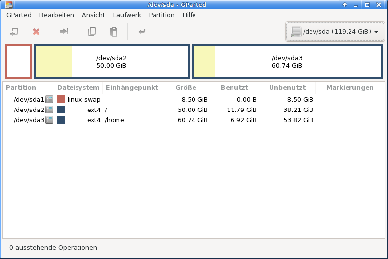
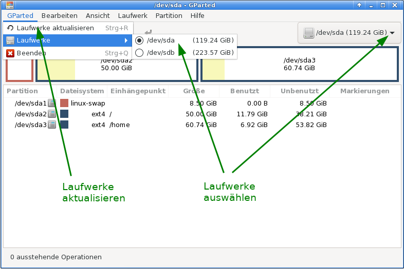
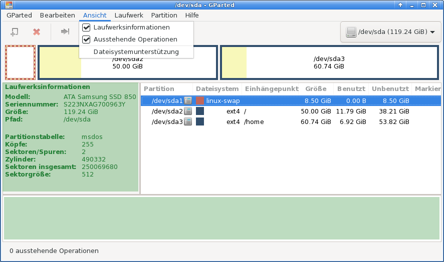
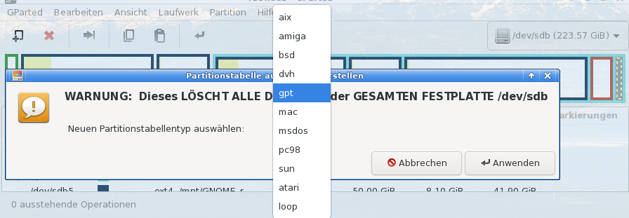
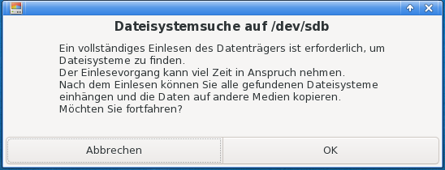
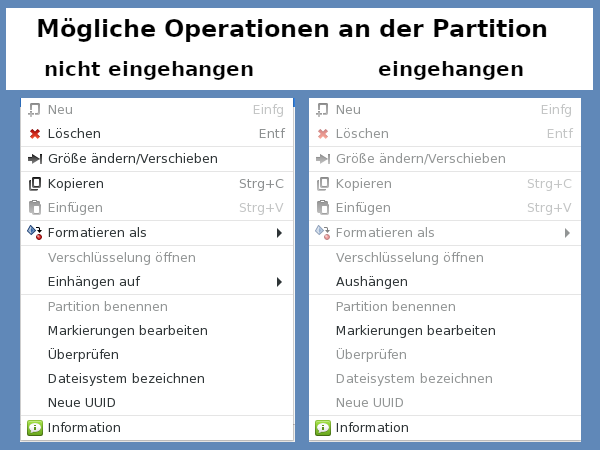
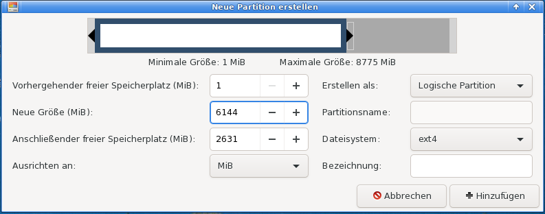
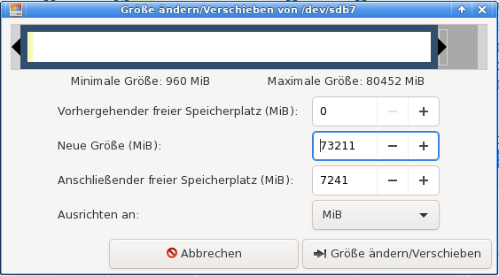

% Partitionieren mit GParted

## Partitionieren mit GParted

Partitionen zu erstellen oder zu bearbeiten ist keine alltägliche Aufgabe. Daher ist es eine gute Idee, folgende Anleitung einmal gelesen zu haben, um mit dem Konzept eines Partitionsmanagers vertraut zu werden.

### Wichtige Hinweise

+ Zuerst immer ein Daten-Backup anlegen!  

+ Bezüglich der Benennung von Speichergeräten das Kapitel zu [UUID, Partitionsbezeichnung und fstab](0311-part-uuid_de.md#uuid---benennung-von-blockgeräten) zu Rate ziehen, da siduction in der Grundeinstellung Benennung nach UUID verwendet.

+ Größenänderungen bei **NTFS-Partitionen** erfordern nach der Ausführung einen sofortigen Reboot, vorher dürfen keine weiteren Änderungen an Partitionen durchgeführt werden. Dies führte unweigerlich zu Fehlern.
[Bitte lese hier weiter.](0312-part-gparted_de.md#ntfs-partitionsgrößen-mit-gparted-ändern)

+ Eine Partition benötigt ein Dateisystem. Linux kann auf und mit verschiedenen Dateisystemen arbeiten.  
  Für normalen Gebrauch empfehlen wir das Dateisystem **ext4**.  
  NTFS sollte man verwenden, wenn die Partition auch von einer Windows-Installation benutzt werden soll. Siduction kann mit dem automatisch installierten `ntfs-3g` lesend und schreibend auf die Daten zugreifen.  

+ Die gesamte GParted-Dokumentation findet sich in vielen Sprachen auf der [GParted-Homepage](https://gparted.org/documentation.php).

### GParted verwenden

Der Programmstarter  für GParted befindet sich in

+ **KDE, LXQt, XFCE**  
im Anwendungsmenü - System - GParted

+ **Gnome**  
in Anwendungen - Gparted

Nach dem Klick auf den Starter öffnet sich ein Dialog zur Abfrage des Root-Passwortes.

Wenn GParted startet, öffnet sich das Programmfenster und die vorhandenen Laufwerke werden ausgelesen.

Der erste Menüpunkt `GParted` öffnet eine Drop-Down-Liste, zum erneuten Einlesen der Laufwerke, zur Auswahl eines Laufwerkes oder zum Beenden des Programms.

+ **Bearbeiten**

    Bearbeiten ist der 2. Menüpunkt von links. Er zeigt drei ausgegraute Optionen, die sehr wichtig sind und weiter unten erläutert werden.  
    + letzte Operationen rückgängig machen ("Undo last operations"),
    + alle Operationen löschen ("clear all operations") und
    + alle Operationen ausführen ("apply all operations").

+ **Ansicht**

    Dieser Menüpunkt bietet die Anzeigeoptionen `Laufwerksinformationen` und `Anstehende Operationen`.

  + Laufwerksinformationen ("Device Information")  
    Im linken Rahmen stehen Details der Laufwerke wie Modell, Größe usw., die wichtig sind, wenn mehrere Datenträger im System vorhanden sind. Damit kann man kontrollieren, ob der richtige Datenträger zur Formatierung gewählt wurde.

  + Anstehende Operationen ("Pending Operations")  
    In einem unten sich öffnenden Rahmen werden die ausstehenden Operationen angezeigt. Diese Information ist sehr nützlich, um einen Überblick darüber zu haben, welche Operationen durchgeführt werden sollen. Der Rahmen öffnet sich auch automatisch, sobald für ein Laufwerk eine Operationen angefordert wird.

  Die beiden Bereiche sind grün markiert.

    

+ **Laufwerk**

  Hinter dem Menüpunkt `Partitionstabelle erstellen` verbergen sich eigentlich zwei Optionen

  1. Eine neue (leere) Partitionstabelle des gleichen Typ erstellen, und damit auf dem schnellsten Weg alle alten Partitionen und Daten zu entfernen.

  2. Einen Wechsel des Typ der Partitionstabelle vorzunehmen. Sinnvoller Weise von **msdos-MBR** zu **gpt-UEFI** oder umgekehrt. Auch hierbei gehen alle Daten verloren.  
    Im Jahr 2009 wurde das UEFI mit GPT eingeführt, hat sich seitdem nach und nach verbreitet, und wird den MBR ersetzen. Zwar unterstützen moderne UEFI-Mainboard MBR, die Vorteile von GPT gehen dabei jedoch verloren. Weitere Informationen zu UEFI und GPT liefert die Handbuchseite [Partitionieren mit gdisk](part-gdisk_de.md#partitionieren-mit-gdisk).

  

  Die Auswahl `Datenrettung versuchen` bietet bei Erfolg die Chance trotz einer defekten Partitionstabelle doch noch an die Daten zu gelangen.

  

+ **Partition**

  Der Menüpunkt `Partition` ist von größter Wichtigkeit. Für die unten ausgewählte Partition zeigt das Menü alle zur Verfügung stehenden Operationen abhängig davon an, ob die Partition eingehangen oder nicht eingehangen ist.  Beachten sollte man, dass einige der Unterpunkte auch kritische bzw. gefährliche Aktionen durchführen können.

  

+ **Eine neue Partition erstellen**

  In der Toolbar erlaubt der Knopf **`Neu`** das Erstellen einer neuen Partition, wenn zuvor ein nicht zugeordneter Bereich gewählt wurde. Im nächsten Fenster erfolgt die Festlegung der Größe für eine primäre, erweiterte oder logische Partition und die Festlegung des Dateisystems.

  

+ **Größe ändern/verschieben**

  Die Partition kann mit der Maus verkleinert, vergrößert und verschoben werden. Alternativ trägt man die neuen Werte in die dafür vorgesehenen Felder ein.

  

+ **Falls ein Fehler gemacht wurde**

  Im Menü `Bearbeiten` besteht die Möglichkeit  
  `Letzte Operation rückgängig machen` oder  
  `Alle Operationen löschen`. Der Bereich ist grün markiert.

  

+ **Anwenden**

  Bis jetzt wurden noch keine Änderungen auf den Laufwerken vorgenommen. Wenn man sicher ist, dass alle vorgesehenen Änderungen richtig sind, wählt man im Menü `Bearbeiten` den Punkt  
  `Alle Operationen ausführen`. Darauf erscheint der folgende Dialog, der zu bestätigen ist.

  

  Die Dauer der Operation hängt von der Größe der gewählten Partition ab.

### fstab anpassen

> Nachdem die Änderungen auf die Laufwerke geschrieben wurden, muss die Datei `/etc/fstab` überprüft und ggf. angepasst werden.

Siehe dazu die Handbuchseite [Anpassung der fstab](0311-part-uuid_de.md#die-fstab).  
In einem root-Terminal geben wir die Befehle **`cat /etc/fstab`** und **`blkid`** ein und vergleichen die UUIDs.

~~~
root@pc1:/# cat /etc/fstab
# /etc/fstab: static file system information.
#
# Use 'blkid' to print the universally unique identifier for a device; this may
# be used with UUID= as a more robust way to name devices that works even if
# disks are added and removed. See fstab(5).
#
# <file system>					 <mount point>  <type>  <options>	<dump><pass>
UUID=2e3a21ef-b98b-4d53-af62-cbf9666c1256	swap           swap    defaults,noatime 0 2
UUID=1c257cff-1c96-4c4f-811f-46a87bcf6abb	/              ext4    defaults,noatime 0 1
UUID=35336532-0cc8-4613-9b1a-f31b12ea58c3	/home          ext4    defaults,noatime 0 2
tmpfs					                	/tmp           tmpfs   defaults,noatime,mode=1777 0 0
UUID=f5ed412d-7b7b-41c1-80ce-53337c82405b	/mnt/Foto      ext4    defaults,noatime 0 0
UUID=4c4b9246-2904-40d1-addc-724fc90a2b6a	/mnt/Backup    ext4    noauto,users,noatime 0 0
UUID=a7aeabe9-f09d-43b5-bb12-878b4c3d98c5	/mnt/TEST_res  ext4    noauto,users,rw,noatime 0 0
~~~

~~~
root@pc1:/# blkid
/dev/sda1: UUID="2e3a21ef-b98b-4d53-af62-cbf9666c1256" TYPE="swap" PARTUUID="000403b7-01"
/dev/sda2: UUID="1c257cff-1c96-4c4f-811f-46a87bcf6abb" BLOCK_SIZE="4096" TYPE="ext4" PARTUUID="000403b7-02"
/dev/sda3: UUID="35336532-0cc8-4613-9b1a-f31b12ea58c3" BLOCK_SIZE="4096" TYPE="ext4" PARTUUID="000403b7-03"
/dev/sdb1: UUID="f5ed412d-7b7b-41c1-80ce-53337c82405b" BLOCK_SIZE="4096" TYPE="ext4" PARTUUID="2853e345-01"
/dev/sdb2: UUID="4c4b9246-2904-40d1-addc-724fc90a2b6a" BLOCK_SIZE="4096" TYPE="ext4" PARTUUID="2853e345-02"
/dev/sdb5: UUID="e2164479-3f71-4216-a4d4-af3321750322" BLOCK_SIZE="4096" TYPE="ext4" PARTUUID="2853e345-05"
/dev/sdb6: UUID="2ef32215-d545-4e12-bc00-d0099a218970" BLOCK_SIZE="4096" TYPE="ext4" PARTUUID="2853e345-06"
~~~

Wir können erkennen, dass die in der fstab als letzter Eintrag enthaltene, nach *"/mnt/TEST_res"* eingehängte Partition in der blkid-Liste nicht mehr enthalten ist. Dafür haben wir zwei neue Partitionen. Bei diesem Beispiel würde der PC einen Reboot zwar durchführen, jedoch *"/mnt/TEST_res"* und die zwei neuen Partitionen nicht automatisch einhängen können. Der Bootvorgang würde sich erheblich verzögern.

> Wenn die UUID für die Partitionen von **/** (root), **/home** und **swap** nicht mit dem jeweiligen Eintrag in der **/etc/fstab** übereinstimmen, müssen die Einträge zwingend angepasst werden, sonst fährt das System nach einem Reboot nicht mehr hoch.

### NTFS-Partitionsgrößen mit GParted ändern

**Größenänderungen bei NTFS-Partitionen erfordern nach der Ausführung einen sofortigen Reboot, vorher dürfen keine weiteren Änderungen an Partitionen durchgeführt werden. Dies führte unweigerlich zu Fehlern.**

* Nach dem Neustart von Windows und dem Windows-Logo erscheint ein Fenster von **`checkdisk`**, das besagt, dass **`C:\`** auf Fehler überprüft wird.
* Diesen AUTOCHECK bitte zu Ende laufen lassen: Windows muss das Filesystem nach einer Größenänderung überprüfen.
* Nach der Überprüfung wird der Rechner automatisch das zweite Mal neu gestartet. Dies gewährleistet, dass das System problemlos laufen kann.
* Nach dem Neustart wird Windows ordnungsgemäß funktionieren. Man muss jedoch das System fertig starten lassen und auf das Anmeldefenster warten!

Zuletzt bearbeitet: 2021-11-28

