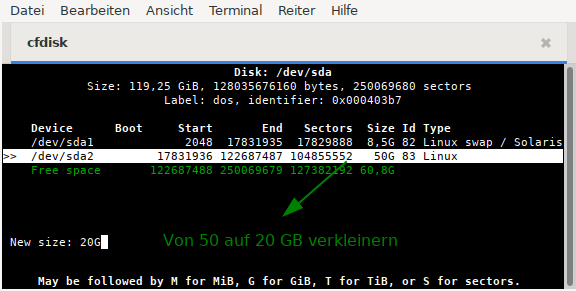
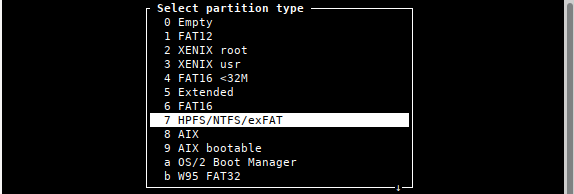

% Partitionieren mit cfdisk

## Partitionieren mit fdisk

**fdisk** und **cfdisk** erstellt MBR-Partitionstabellen auf Basis des BIOS. Im Jahr 2000 begann die Einführung von GPT-Partitionstabellen auf Basis des UEFI. 

Der neuere Standard **G**lobally Unique Identifier **P**artition **T**able (GPT), der Teil des UEFI-Standards ist, hat bei aktueller Hardware den MBR ersetzt und erlaubt Platten/Partitionen größer als 2 TByte und eine theoretisch unbegrenzte Anzahl primärer Partitionen. Weitere Informationen dazu gibt es in [Wikipedia GUID-Partitionstabelle](https://de.wikipedia.org/wiki/GUID_Partition_Table)

Wir empfehlen die Partitionierung mit fdisk und cfdisk ausschließlich für ältere Hardware.  
Zum Erstellen von GPT-Partitionstabellen bitte die Handbuchseite [Partitionieren mit gdisk](part-gdisk_de.md#partitionieren-mit-gdisk) zu Rate ziehen.

### Benennung von Speichergeräten

**Bitte BEACHTEN:**  
siduction verwendet in der `fstab` UUID für die Benennung von Speichergeräten. Bitte das Kapitel [Benennung nach UUID](part-uuid_de.md#uuid---benennung-von-blockgeräten) zu Rate ziehen.

**Festplatten**

Informationen über die Geräte erhält man leicht von einem Informationsfenster (Pop-Up), wenn man mit der Maus auf das Icon eines Geräts auf dem Desktop geht. Dies funktioniert sowohl vom Live-ISO als auch bei einem installierten siduction.

Wir empfehlen die Erstellung einer Tabelle (manuell oder generiert), welche die Details aller Geräte enthält. Dies kann sehr hilfreich sein, falls Probleme auftreten. In einem Terminal werden wir mit **`su`** zu **root** und geben **`fdisk -l`** ein. Bei zwei Festplatten bekommen wir z. B. eine Ausgabe ähnlich der unten gezeigten.

~~~
user1@pc1:/$ su
Passwort:
root@pc1:/# fdisk -l

Disk /dev/sda: 149,5 GiB, 160041885696 bytes, 312581808 sectors
Disk model: FUJITSU MHY2160B
Units: sectors of 1 * 512 = 512 bytes
Sector size (logical/physical): 512 bytes / 512 bytes
I/O size (minimum/optimal): 512 bytes / 512 bytes
Disklabel type: dos
Disk identifier: 0x6513a8ff

Device   Boot   Start       End   Sectors Size Id Type
/dev/sda1        2048  41945087  41943040  20G 83 Linux
/dev/sda2    41945088  83888127  41943040  20G 83 Linux
/dev/sda3    83888128  88291327   4403200 2,1G 82 Linux swap
/dev/sda4    88291328 312581807 224290480 107G  5 Extended
/dev/sda5    88293376 249774079 161480704  77G 83 Linux
/dev/sda6   249776128 281233407  31457280  15G 83 Linux
/dev/sda7   281235456 312581807  31346352  15G 83 Linux

Disk /dev/sdb: 119,25 GiB, 128035676160 bytes, 250069680 sectors
Disk model: Samsung SSD 850 
Units: sectors of 1 * 512 = 512 bytes
Sector size (logical/physical): 512 bytes / 512 bytes
I/O size (minimum/optimal): 512 bytes / 512 bytes
Disklabel type: dos
Disk identifier: 0x000403b7

Device   Boot  Start       End   Sectors  Size Id Type
/dev/sdb1       2048  17831935  17829888  8,5G 82 Linux swap
/dev/sdb2   17831936 122687487 104855552   50G 83 Linux
/dev/sdb3  122687488 250068991 127381504 60,8G 83 Linux
~~~

Mit dem Befehl  
**`fdisk -l > /home/<MEIN USER NAME>/Dokumente/fdisk-l_Ausgabe`** erhalten wir eine Text-Datei mit dem gleichen Inhalt.

**Partitionen**

Die Partitionen auf einer MBR-Festplatte werden durch eine Zahl zwischen 1 und 15 definiert. Es sind maximal 14 mountbare Partitionen möglich.

Es gibt folgende Partitionstypen:  
primäre, erweiterte und logische.

Die logischen Partitionen befinden sich innerhalb der erweiterten Partition. Es sind maximal vier primäre bzw. drei primäre und eine erweiterte Partition anlegbar. Die erweiterte Partition wiederum kann bis zu elf logische Partitionen enthalten.  
Primäre oder erweiterte Partitionen erhalten eine Bezeichnung zwischen 1 und 4 (zum Beispiel sda1 bis sda4). Logische Partitionen sind immer gebündelt und Teil einer erweiterten Partition. Mit libata können maximal elf logische Partitionen definiert werden, und ihre Bezeichnungen beginnen mit Nummer 5 und enden höchstens mit Nummer 15.

**Beispiele**

~~~
4 Partitionen (alles primäre):

|sda1|sda2|sda3|sda4|

6 Partitionen (3 primäre, 1 erweiterte und 3 logische):

|sda1|sda2|sda3|-
                 |         enthält nur 
               |sda4| ->   Verweise auf
                 |         logische Partitionen
                 |
               |sda5|sda6|sda7|
~~~

*"/dev/sda5"*  kann nur eine logische Partition sein (in diesem Fall die erste logische auf diesem Gerät). Sie befindet sich auf der ersten Festplatte des Computers (abhängig von der BIOS-Konfiguration).

*"/dev/sdb3"*  kann nur eine primäre oder erweiterte Partition sein. Der Buchstabe "b" indiziert, dass diese Partition sich auf einem anderen Gerät befindet als die Partition des ersten Beispiels, welche den Buchstaben "a" enthält.

### Cfdisk verwenden

> **Daten zuvor sichern!**  
> Bei Verwendung jedweder Partitionierungssoftware droht Datenverlust. Daten, die erhalten bleiben sollen immer zuvor auf einem anderen Datenträger sichern.

cfdisk wird in einer Konsole als **root** gestartet (nach **`su`** ist die Eingabe des root-Passworts gefordert):

~~~
user1@pc1:/$ su
Passwort:
root@pc1:/#
cfdisk /dev/sda
~~~

cfdisk nur auf einer Festplatte anwenden, deren sämtliche Partitionen nicht eingehangen sind. Alle Daten gehen mit dem Schreiben der geänderten Partitionstabelle verloren.

#### Die Bedienoberfläche

Im ersten Bildschirm zeigt cfdisk die aktuelle Partitionstabelle mit den Namen und einigen Informationen zu jeder Partition. Am unteren Ende des Fensters befinden sich einige Befehlsschalter. Um zwischen den Partitionen zu wechseln, benutzt man die Pfeiltasten **`auf`** und **`ab`**, um Befehle auszuwählen, die Pfeiltasten **`rechts`** und **`links`**. Mit der **`Enter`** Taste wird der Befehl ausgeführt.

Wir haben auf der Beispielfestplatte drei Partitionen.

| Device | Part. Größe | Part. Typ | Mountpoint |
| --- | ---: | :---: | ---: |
| /dev/sda1 | 8,5G | 82 Swap | - |
| /dev/sda2 | 50,0G | 83 Linux | / |
| /dev/sda3 | 60,8G | 83 Linux | /Daten |

Aus der Daten-Partition möchten wir die Verzeichnisse `/Bilder` und `/Musik` in eigene Partitionen auslagern und dafür mehr Platz schaffen. Gleichzeitig sollen diese auch für ein auf einer weiteren Festplatte residierendes Windows zugänglich sein. Die Root-Partition ist mit 50 GB überdimensioniert und wird verkleinert.

#### Löschen einer Partition

Um Platz zu schaffen, löschen wir die Daten-Partition und verkleinern anschließend die Root-Partition.

Um die Partition `/dev/sda3` zu löschen, wird sie mit den auf-ab-Tasten markiert und der Befehl **`Delete`** mit den Pfeiltasten links-rechts gewählt und durch **`Enter`** bestätigt.

 

#### Größe einer Partition ändern

Die Partition `/dev/sda2` wird markiert und der Befehl **`Resize`** ausgewählt und bestätigt.

Anschließend erfolgt die Eingabe der neuen Größe von `20G`

#### Erstellen einer neuen Partition

Der nun freie Platz der Festplatte wird markiert. Die Befehlsauswahl springt automatisch auf **`New`**, die zu bestätigen ist.

Anschließend ist die neue Größe von `15G` für die Daten-Partition einzugeben.

Jetzt muss zwischen einer *"primären"* oder einer *"erweiterten"* (extended) Partition entschieden werden. Wir entscheiden uns für eine primäre Partition.

Danach wird wieder der freie Plattenplatz markiert, bestätigt und die voreingestellte gesamte Größe ebenso bestätigt. In der folgenden Auswahl ist `extended` zu wählen. Dies erstellt die Erweiterte Partition (hier 'Container' genannt) in der die zwei zusätzlichen Partitionen anzulegen sind.

Zum Schluss sind die Partitionen für Musik und Bilder entsprechend dem oben gezeigten Vorgehen in der gewünschten Größe anzulegen. Da nur noch logische Partitionen möglich sind, entfällt die Auswahl zwischen primärer und erweiterter Partition.

So sieht das Ergebnis aus.

#### Partitionstyp

Um den Typ einer Partition zu ändern, markiert man die gewünschte Partition und wählt den Befehl **`Type`** aus.

Es erscheint eine Auswahlliste in der mit den Pfeiltasten auf und ab der Partitionstyp gewählt wird. In unserem Beispiel wählen wir für die Partitionen `/dev/sda5` und `/dev/sda6` den Typ *"7 HPFS/NTFS/exFAT"* aus. So kann das oben erwähnte Windows auf die Partition zugreifen.

#### Eine Partition bootfähig machen

Für Linux besteht kein Grund, eine Partition bootfähig zu machen, aber einige andere Betriebssysteme brauchen das. Dabei wird die entsprechende Partition markiert und der Befehl **`Bootable`** gewählt (Anmerkung: Bei Installation auf eine externe Festplatte muss eine Partition bootfähig gemacht werden).

#### Partitionstabelle schreiben

Wenn alles fertig partitioniert ist, kann das Resultat mit dem Befehl **`Write`** gesichert werden. Die Partitionstabelle wird jetzt auf die Platte geschrieben.

**Da damit alle Daten auf der entsprechenden Festplatte/Partition gelöscht werden** , sollte man sich seiner Sache wirklich sicher sein, bevor man **`yes`** eintippt und noch einmal mit **`Enter`** bestätigt.

#### Cfdisk beenden

Mit dem Befehl **`Quit`** verlassen wir das Programm. Nach Beendigung von cfdisk und vor der Installation sollte man auf jeden Fall rebooten, um die Partitionstabelle neu einzulesen.

### Formatieren von Partitionen

Es gibt für Linux verschiedene Filesysteme, die man benutzen kann. Da wären **Ext2**, **Ext4**, **ReiserFs** und für erfahrenere Anwender **XFS**, **JFS** und **ZFS**.  
Ext2 kann von Interesse sein, wenn man von Windows aus zugreifen möchte, da es Windows-Treiber für dieses Dateisystem gibt. [Ext2-Dateisystem für MS Windows (Treiber und englischsprachige Doku)](http://www.fs-driver.org/).

Für normalen Gebrauch empfehlen wir das Dateisystem **ext4**. Es ist das Standard-Dateisystem von siduction. 

Nach Beendigung von cfdisk wird die Root-Konsole weiter verwendet. Eine Formatierung erfordert Root-Rechte.  
Der Befehl lautet **`mkfs.ext4 /dev/sdaX`**. Für "X" trägt man die Nummer der ausgewählten Partition ein.

~~~
mkfs.ext4 /dev/sda2
mke2fs 1.45.6 (20-Mar-2020)
/dev/sdb2 contains a ext4 file system
	last mounted on Tue May 26 14:26:34 2020
Proceed anyway? (y,N)
~~~

Die Abfrage wird mit **`y`** beantwortet, wenn man darin sicher ist, dass die richtige Partition formatiert werden soll. Bitte mehrfach überprüfen!

Nach Abschluss der Formatierung muss die Meldung erfolgen, dass **ext4** erfolgreich geschrieben wurde. Ist das nicht der Fall, ist bei der Partitionierung etwas schiefgelaufen oder *"sdaX"* ist keine Linux-Partition. Wir überprüfen mit:

~~~
fdisk -l /dev/sda
~~~

Wenn etwas falsch ist, muss gegebenenfalls noch einmal partitioniert werden.

War die Formatierung erfolgreich, so wird dieser Ablauf für die anderen Partitionen wiederholt, wobei der Befehl entsprechend des Partitions-Typ und des gewünschten Dateisystem anzupassen ist. (z. B.: `mkfs.ext2` oder `mkfs.vfat` oder `mkfs.ntfs` usw.)
Bitte die Manpage **`man mkfs`** lesen.

Zuletzt wird die Swap-Partition formatiert, in diesem Fall **sda1**:

~~~
mkswap /dev/sda1
~~~

Im Anschluss wird die Swap-Partition aktiviert:

~~~
swapon /dev/sda1
~~~

Danach kann in der Konsole überprüft werden, ob die Swap-Partition erkannt wird:

~~~
swapon -s
~~~

Bei eingebundener Swap-Partition sollte die Ausgabe auf den vorherigen Befehl etwa so aussehen:

~~~
Filename        Type        Size      Used   Priority
/dev/sda1       partition   8914940   0      -2
~~~

Wird die Swap-Partition korrekt erkannt, starten wir den Computer neu.

Jetzt kann die Installation beginnen.

Zuletzt bearbeitet: 2021-03-08

