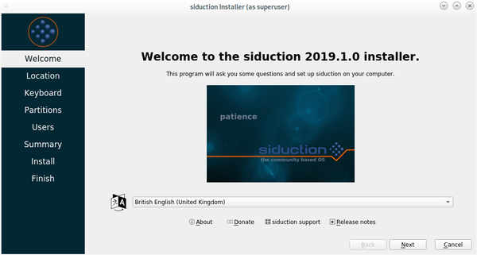
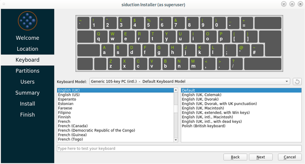
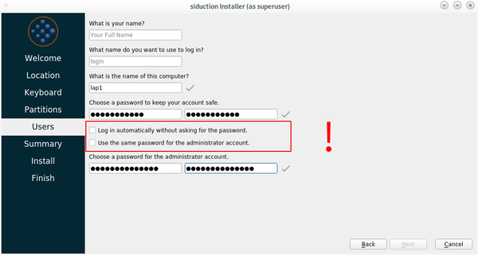
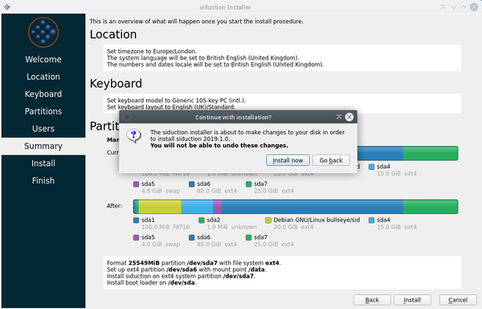
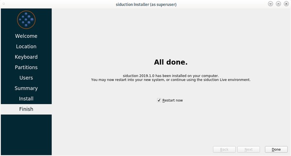
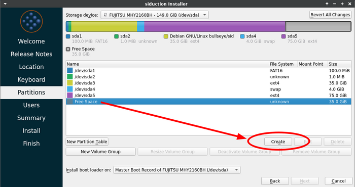

% Installation on HDD

## Installation on HDD

### Data backup

> **IMPORTANT: ALWAYS CREATE A DATA BACKUP!**  
> If the installation target is already home to an operating system or data is to be preserved, please always create a backup before installing siduction.  

### Installation preparations

First, change the boot order so that the medium to be booted (DVD, flashcard, or USB stick) is at the top of the list. On most computers, pressing the **`F2`** or **`Del`** key during the boot process takes you to the UEFI or BIOS setup. Alternatively, pressing **`F12`**, **`F11`**, **`F7`**, or **`F8`** (depending on the hardware manufacturer's specifications) during the boot process will take you directly to the boot menu where you can select the live media as the boot drive.

siduction usually starts without problems now. If this is not the case, boot options (cheat codes), which can be passed to the boot manager, are helpful. The manual page [Cheatcodes](0204-cheatcodes_en.md#boot-options-and-cheat-codes) explains the possible options.  
At the start screen, use the arrow keys to navigate to *"From CD/DVD/ISO: ..."* or *"From Stick/HDD: ..."* (according to the used live medium) and press **`e`**. This takes you to the kernel command line where you can add the cheatcodes. Pressing **`F10`** will continue the boot process.

**Before the installation, please remove all USB sticks, cameras, etc.**

If siduction is not to be installed from, but **to a USB medium**, a different procedure is necessary. See the manual page [Installation to a USB medium](0207-iso-to-usb-sd_en.md#iso-to-usb-stick---memory-card).

**HDD, RAM, and Swap**

The minimum requirements for installing the siduction variants are described on the manual page [Live ISO content](0201-cd-content_en.md#minimum-system-requirements).  
With 15 GB hard disk space and 2 GB RAM you are currently on the safe side. 
A swap partition should be created on PCs with 1 GByte RAM or less. More than 2 GByte swap is rarely required and only useful for suspend to disk and server systems.

### Partitioning

The partitioning of the drives depends on many factors:

+ the chosen siduction variant
+ size of the available drives and RAM
+ single-boot or dual-boot with an already installed system (Windows, Linux, MAC)
+ sharing of data for the installed systems

Examples and sizes for different installation situations are described on the manual page [Partitioning](0310-part-size-examp_en.md#partitioning-of-installation-media).  
We recommend leaving the `/home` directory on the root partition. The `/home` directory should be the place where individual configurations are stored, and only those. For all other private data, including `.ssh`, `.gnupg`, and the mail archives, a separate data partition should be created and linked to the `/home` directory if necessary. The advantages for data stability, data backup, and also in case of data recovery are almost immeasurable.  

The partitioning can be done during installation or already in advance during the live session with the following programs:  
[Gparted](0312-part-gparted_en.md#partitioning-with-gparted), a graphical user interface program for GTK desktops  
KDE Partition Manager, another graphical user interface program for Qt desktops  
[gdisk](0313-part-gdisk_en.md#partitioning-with-gdisk), recommended for UEFI hardware with GTP partition tables  
[cfdisk](0314-part-cfdisk_en.md#partitioning-with-fdisk), only for older hardware with traditional BIOS and MBR partition tables

### File systems

We recommend the **ext4** file system, which is used as the default file system on siduction. This applies to all partitions if only Linux operating systems are used.

For a dual-boot installation with *Windows*, a separate data partition with the **NTFS** file system makes sense. Linux can read and write to it; on Windows it is the default file system.

For a dual-boot installation with *MAC*, it also makes sense to have a separate data partition, but with the **HFS** or **HFS+** file system. Linux and MAC can have read and write access to it.

### Duplication to another computer

The following console command creates a list of installed software packages. This list can be used to install an identical software selection on another computer or in the event of a new installation:

~~~sh
~# dpkg -l|awk '/^ii/{ print $2 }'|grep -v -e ^lib -e -dev -e $(uname -r) >/home/username/installed.txt
~~~

We recommend to copy this text file to a USB drive or a disk of your choice.  
The text file can then be copied to the target systems `$HOME` directory and be used as a reference to install the required program packages. You can install the complete package list via

~~~sh
~# apt install $(/home/username/installed.txt)
~~~

### The Calamares installer

During the installation, the computer should preferably be connected to the Internet because Calamares uses the GeoIP service to determine default settings for localization and time.

1. The installation program can be started comfortably via the  icon on the desktop or in the menu: *"System"* > *"Install system"*.

2. After a double click on the icon, Calamares starts and we see the "*Welcome*" window.

   

   If an internet connection is provided, the correct language should already be set here.

3. In the next window ("*Location*"), you have the possibility to make changes to *region*, *timezone*, and *system language*, as well as the date and number *format*.

    

4. Next, you can set up the keyboard.

   

   In the upper section, the keyboard is displayed graphically and the changes are visible immediately. At the bottom, there is an input line to test the keyboard layout.

5. Then we reach the already mentioned partitioning, which determines the parts of the harddisk(s) siduction uses.

   

   In our example, we use *"Manual partitioning"* because the partitions have already been created in advance and we only need to select the correct installation target. After clicking *"Next"*, the following window appears where we can select and edit the individual partitions.

   

   We use the partitions:  
   sda7 for `/` (root)  
   sda6 for `/data` together with the Linux system already present on sda3 and sda4

   After selecting the partition in question and pressing the *"Change"* button, a window opens where we enter the above mountpoint and also format sda7 with the **ext4** file system. The partition sda6 is not formatted because we want to use the data already stored there together with the existing Linux system.  
   We do not need to edit the swap partition (sda5) since it will be automatically detected and integrated during the installation.  
   We can see the result of our efforts in the next image.

   

6. Next, we set username, login name, computer name, user password, and root password (remember them well!). The passwords should not be too simple for security reasons. Additional users can be added after installation in a terminal with [adduser](#adduser).

   

   We explicitly recommend not to use the options  
   "*Log in automatically without password prompt*" and  
   "*Use the same password for the administrator account*".  
   They both represent a security risk on their own (see also [sudo](term-console_en.md#work-as-root)). If both options are enabled, entering passwords is just a farce!

7. After pressing the *"Next"* button, a summary of all previously made entries appears. Now you still have the possibility to make changes via *"Back"*. If you are satisfied with the result, a click on *"Install"* opens the small warning window in which you have to confirm the installation.

    

8. Now the installation starts. This takes some time depending on the hardware. The progress will be displayed respectively. Even if it takes a little longer, please do not abort the installation, but give the process time.

   

9. At the end, we get the possibility to reboot into the newly installed system. 

   

   Remove the CD from the drive before rebooting!

### Encrypt system

Since *siduction 2021.2 Farewell*, the installer provides the possibility to install the complete system onto an encrypted partition or hard disk. Only the first stage of the boot manager *Grub* is located (without encryption) on the *"BIOS-boot"* partition. Grub asks for the encrypted installations password at the beginning of every boot process before the boot menu appears.  
The partitioning described in step 5 above is now slightly different. When selecting one of the first three options, the function *"Encrypt system"* appears in addition, where we also enter the password at the same time.

If we use *"Manual partitioning"*, we need an empty, unused area on the hard disk. In case this is not available, we first delete one or more partitions that are no longer needed. Then we create the new partition.

In the next step, the function *"Encrypt"* is selectable now.

We enter our password and then select the root directory `/` as mount point.  
After finishing the partitioning, we continue the installation with the menu item *"User"* as described above in step 6.

### Add user

To add new users with automatic takeover of group permissions, run the following command as **root**:

~~~sh
~# adduser <username>
~~~

Pressing the **`Enter`** key will bring up more options that allow additional settings. Finally, a prompt appears, asking to enter the password twice.

siduction specific desktop icons (for the manual and IRC) must be added yourself. 

To remove a user, enter:

~~~sh
~# deluser <username>
~~~

More information:

~~~sh
man adduser
man deluser
~~~

Last edited: 2022/03/30

