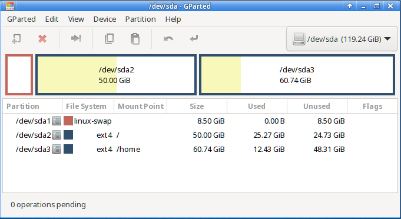
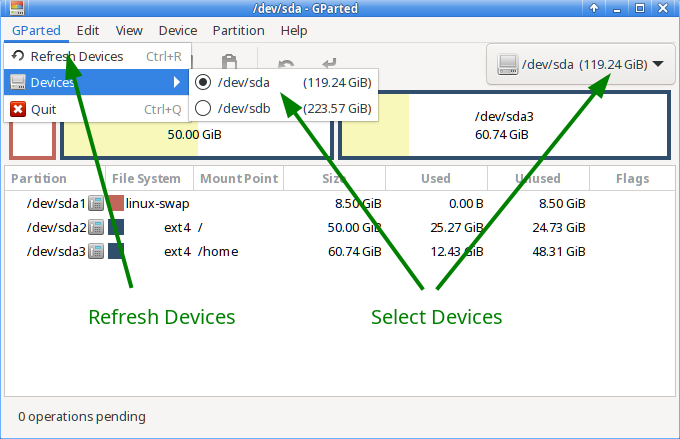
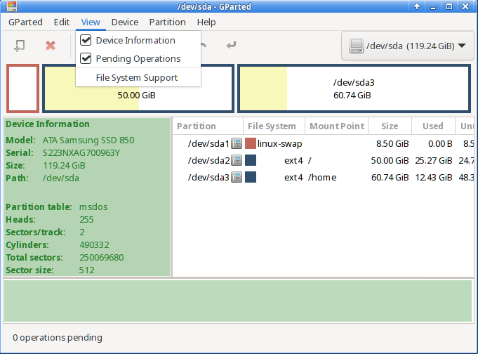
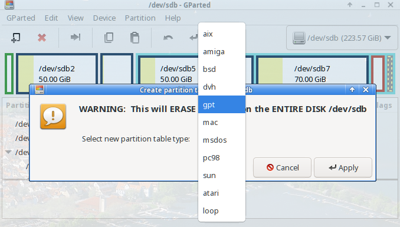
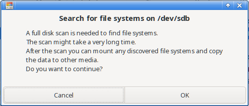
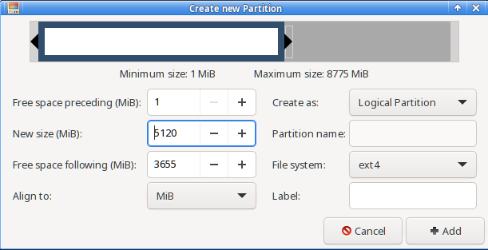
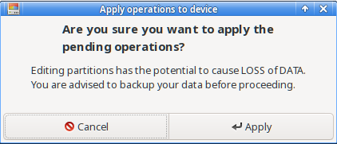

% Partitioning with Gparted

## Partitioning with GParted

Creating or editing partitions is not an everyday task. Therefore, it is a good idea to read the following guide at least once to get familiar with the concept of a partition manager.

### Important notes

+ Always create a data backup first!  

+ Regarding the naming of storage devices, consult the chapter about [UUID, partition naming and fstab](0311-part-uuid_en.md#uuid---naming-of-block-devices) because siduction uses naming by UUID by default.

+ Resizing **NTFS partitions** requires an immediate reboot after execution. No further changes to partitions may be made before that since this inevitably will lead to errors.
[Please read on here.](0312-part-gparted_en.md#changing-ntfs-partition-sizes-with-gparted)

+ A partition needs a file system. Linux can work on and with different file systems.  
  For normal use, we recommend the **ext4** file system.  
  **NTFS** should be used if the partition is also to be used by a Windows installation. siduction can read and write data to such partitions through the automatically installed `ntfs-3g`.  

+ The complete GParted documentation can be found in many languages on the [GParted homepage](https://gparted.org/documentation.php).

### Using GParted

The program launcher for GParted can be found in

+ **KDE, LXQt, Xfce**  
in the application menu - *"System"* - *"GParted"*

+ **Gnome**  
in *"Applications"* - *"Gparted"*

After clicking on the launcher, a dialog will open and ask for the root password.

When GParted starts, the program window opens and the available drives are read.

The first menu item *"GParted"* opens a drop-down list which allows you to read the drives again, to select a drive or to quit the program.

+ **Edit**

    Edit is the 2nd menu item from the left. It shows three grayed out options that are very important and explained below:  
    + *"Undo last operations"*,
    + *"Clear all operations"*, and
    + *"Apply all operations"*.

+ **View**

    The next menu item offers the display options `Device Information` and `Pending Operations`.

  + Device Information  
    The left frame contains details of the drives such as model, size, etc., which are important if there are multiple disks in the system. It can be used to check whether the correct disk has been selected for formatting.

  + Pending Operations  
    The pending operations are displayed in a frame that opens at the bottom. This information is very useful to have an overview of which operations are to be performed. The frame also opens automatically when an operation is requested for a drive.

  The two areas are highlighted in green.

    

+ **Device**

  The menu item `Create Partition Table...` actually contains two options:

  1. Create a new (empty) partition table of the same type, and thus remove all old partitions and data in the fastest way.

  2. Change the partition table type. It makes sense to change from **msdos-MBR** to **gpt-UEFI** or vice versa. Here, too, all data will be lost.  
    In 2009, UEFI with GPT was introduced, has been gradually spreading ever since, and will replace the MBR. While modern UEFI mainboards support MBR, the benefits of GPT are lost. More information about UEFI and GPT can be found on the manual page [Partitioning with gdisk](0313-part-gdisk_en.md#partitioning-with-gdisk).

  

  The option `Attempt Data Rescue...` offers the chance to get the data despite a defective partition table.

  

+ **Partition**

  The menu item `Partition` is of utmost importance. For the partition selected below, the menu shows all available operations depending on whether the partition is mounted or unmounted. Note that some of the sub-items can also perform critical or dangerous actions.

  

+ **Create a new partition**

  In the toolbar, the **`New`** button allows you to create a new partition if an unallocated area was previously selected. The appearing window lets you specify the size and the file system type for a primary, extended, or logical partition.

  

+ **Resize/Move**

  The partition can be resized, enlarged, and moved with the mouse. Alternatively, enter the new values into the provided fields.

  

+ **If a mistake has been made**

  In the `Edit` menu, you can find the options  
  `Undo Last Operation` and  
  `Delete All Operations`. The area is highlighted in green.

  

+ **Apply**

  No changes have been made to the drives yet. If you are sure that all the intended changes are correct, select `Apply All Operations` in the `Edit` menu. The following dialog will appear, which should be confirmed.

  

  The duration of the operation depends on the size of the selected partition.

### Adjust fstab

> After the changes have been written to the drives, the /etc/fstab file must be checked and adjusted if necessary.

See the manual page [Adjusting fstab](0311-part-uuid_en.md#the-fstab).  
In a **root** terminal, enter the commands **`cat /etc/fstab`** as well as **`blkid`** and compare the UUIDs.

~~~
root@pc1:/# cat /etc/fstab
# /etc/fstab: static file system information.
#
# Use 'blkid' to print the universally unique identifier for a device; this may
# be used with UUID= as a more robust way to name devices that works even if
# disks are added and removed. See fstab(5).
#
# <file system> <mount point> <type> <options> <dump><pass>
UUID=2e3a21ef-b98b-4d53-af62-cbf9666c1256 swap swap defaults,noatime 0 2
UUID=1c257cff-1c96-4c4f-811f-46a87bcf6abb / ext4 defaults,noatime 0 1
UUID=35336532-0cc8-4613-9b1a-f31b12ea58c3 /home ext4 defaults,noatime 0 2
tmpfs /tmp tmpfs defaults,noatime,mode=1777 0 0
UUID=f5ed412d-7b7b-41c1-80ce-53337c82405b /mnt/photo ext4 defaults,noatime 0 0
UUID=4c4b9246-2904-40d1-addc-724fc90a2b6a /mnt/Backup ext4 noauto,users,noatime 0 0
UUID=a7aeabe9-f09d-43b5-bb12-878b4c3d98c5 /mnt/TEST_res ext4 noauto,users,rw,noatime 0 0
~~~

~~~
root@pc1:/# blkid
/dev/sda1: UUID="2e3a21ef-b98b-4d53-af62-cbf9666c1256" TYPE="swap" PARTUUID="000403b7-01"
/dev/sda2: UUID="1c257cff-1c96-4c4f-811f-46a87bcf6abb" BLOCK_SIZE="4096" TYPE="ext4" PARTUUID="000403b7-02"
/dev/sda3: UUID="35336532-0cc8-4613-9b1a-f31b12ea58c3" BLOCK_SIZE="4096" TYPE="ext4" PARTUUID="000403b7-03"
/dev/sdb1: UUID="f5ed412d-7b7b-41c1-80ce-53337c82405b" BLOCK_SIZE="4096" TYPE="ext4" PARTUUID="2853e345-01"
/dev/sdb2: UUID="4c4b9246-2904-40d1-addc-724fc90a2b6a" BLOCK_SIZE="4096" TYPE="ext4" PARTUUID="2853e345-02"
/dev/sdb5: UUID="e2164479-3f71-4216-a4d4-af3321750322" BLOCK_SIZE="4096" TYPE="ext4" PARTUUID="2853e345-05"
/dev/sdb6: UUID="2ef32215-d545-4e12-bc00-d0099a218970" BLOCK_SIZE="4096" TYPE="ext4" PARTUUID="2853e345-06"
~~~

We can see that the last entry in the `fstab` (mounted to `/mnt/TEST_res`) is no longer contained in the `blkid` list. Instead, we have two new partitions. In this example, the PC would perform a reboot but would not be able to mount `/mnt/TEST_res` and the two new partitions automatically. The boot process would be delayed considerably.

> If the UUID's for the partitions of **/** (root), **/home**, and **swap** do not match the entries in **/etc/fstab**, it is mandatory to adjust the entries. Otherwise, the system will not start after a reboot.

### Changing NTFS partition sizes with GParted

**Resizing NTFS partitions requires an immediate reboot after execution. No further changes to partitions may be made before then. This will inevitably lead to errors.**

* Once Windows has started and the Windows logo has disappeared, a **checkdisk** window appears which says that **C:\\** is being checked for errors.
* Please let this AUTOCHECK finish its job: Windows must check the file system after a resize.
* After the check, the computer is automatically rebooted the second time. This ensures that the system can run without problems.
* After the restart, Windows will work properly. However, you have to let the system finish booting and wait for the login window!

Last edited: 2022/03/31

