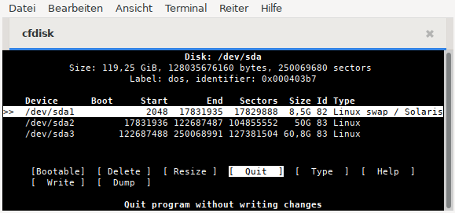
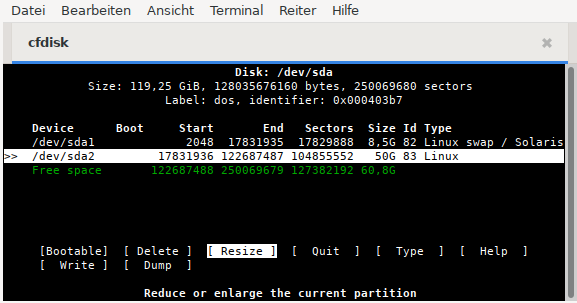
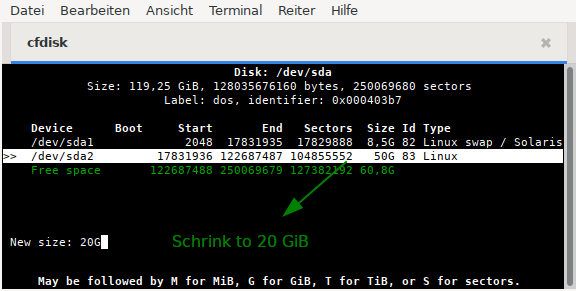
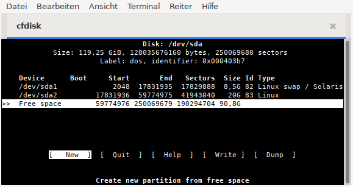
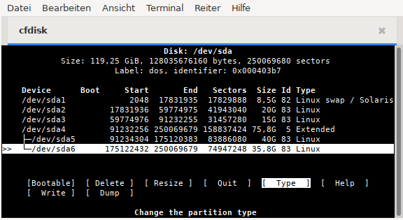

% Partitioning with cfdisk

## Partitioning with fdisk

**fdisk** and **cfdisk** create MBR partition tables based on the BIOS. The introduction of GPT partition tables based on UEFI began in 2000.

The newer **G**lobally Unique Identifier **P**artition **T**able (GPT) standard, which is part of the UEFI standard, has replaced MBR on current hardware and allows disks/partitions larger than 2 TBytes and a theoretically unlimited number of primary partitions. More information about this can be found in [Wikipedia GUID partition table](https://en.wikipedia.org/wiki/GUID_Partition_Table).

We recommend to use *fdisk* and *cfdisk* only for partitioning on older hardware.  
For creating GPT partition tables, please refer to the manual page [Partitioning with gdisk](0313-part-gdisk_en.md#partitioning-with-gdisk).

### Naming storage devices

**Please NOTE:**  
siduction uses UUID in `fstab` for storage device naming. Please refer to the chapter [Naming by UUID](0311-part-uuid_en.md#uuid---naming-of-block-devices).

**Disks**

Information about the devices can be easily obtained from an information window (pop-up) by hovering the mouse over the icon of a device on the desktop. This works both from the live ISO and with siduction installed.

We recommend creating a table (manual or generated) that contains the details of all devices. This can be very helpful if problems arise. In a terminal, we become **root** with **`su`** and type **`fdisk -l`**. For example, with two disks, we get output similar to that shown below.

~~~
user1@pc1:/$ su
password:
root@pc1:/# fdisk -l

Disk /dev/sda: 149.5 GiB, 160041885696 bytes, 312581808 sectors
Disk model: FUJITSU MHY2160B
Units: sectors of 1 * 512 = 512 bytes
Sector size (logical/physical): 512 bytes / 512 bytes
I/O size (minimum/optimal): 512 bytes / 512 bytes
Disklabel type: dos
Disk identifier: 0x6513a8ff

Device   Boot   Start       End   Sectors Size Id Type
/dev/sda1        2048  41945087  41943040  20G 83 Linux
/dev/sda2    41945088  83888127  41943040  20G 83 Linux
/dev/sda3    83888128  88291327   4403200 2,1G 82 Linux swap
/dev/sda4    88291328 312581807 224290480 107G  5 Extended
/dev/sda5    88293376 249774079 161480704  77G 83 Linux
/dev/sda6   249776128 281233407  31457280  15G 83 Linux
/dev/sda7   281235456 312581807  31346352  15G 83 Linux

Disk /dev/sdb: 119,25 GiB, 128035676160 bytes, 250069680 sectors
Disk model: Samsung SSD 850 
Units: sectors of 1 * 512 = 512 bytes
Sector size (logical/physical): 512 bytes / 512 bytes
I/O size (minimum/optimal): 512 bytes / 512 bytes
Disklabel type: dos
Disk identifier: 0x000403b7

Device   Boot  Start       End   Sectors  Size Id Type
/dev/sdb1       2048  17831935  17829888  8.5G 82 Linux swap
/dev/sdb2   17831936 122687487 104855552   50G 83 Linux
/dev/sdb3  122687488 250068991 127381504 60,8G 83 Linux
~~~

By entering the command  
**`fdisk -l > /home/<MY USER NAME>/documents/fdisk-l_output`** we get a text file with the same content.

**Partitions**

The partitions on an MBR hard disk are defined by a number between 1 and 15. A maximum of 14 mountable partitions is possible.

The following partition types exist:  
primary, extended, and logical.

The logical partitions are located within the extended partition. A maximum of four primary or three primary and one extended partition can be created. The extended partition, in turn, can contain up to eleven logical partitions.  
Primary or extended partitions are given a designator between 1 and 4 (for example sda1 to sda4). Logical partitions are always bundled and part of an extended partition. A maximum of eleven logical partitions can be defined with *libata*, and their names start with number 5 and end with number 15 at most.

**Examples**

~~~
4 partitions (all primary):

|sda1|sda2|sda3|sda4|

6 partitions (3 primary, 1 extended, and 3 logical):

|sda1|sda2|sda3|-
                 |       contains only 
               |sda4| -> references to
                 |       logical partitions
                 |
               |sda5|sda6|sda7|
~~~

**/dev/sda5** can only be a logical partition (in this case the first logical one on this device). It is located on the first hard disk of the computer (depending on the BIOS configuration).

**/dev/sdb3** can only be a primary or extended partition. The letter "b" indicates that this partition is on a different device than the partition of the first example, which contains the letter "a".

### Use cfdisk

**Backup data beforehand!**  
> There is a risk of data loss when using any partition editor. Always back up data you want to keep on another disk first.

**cfdisk** is started in a console as **root** (after **`su`** the root password is required):

~~~
user1@pc1:/$ su
password:
root@pc1:/#
cfdisk /dev/sda
~~~

**cfdisk** should only be used on a hard disk with all partitions unmounted. All data will be lost when the changed partition table is written.

**The user interface**

On the first screen, `cfdisk` shows the current partition table with the names and some information about each partition. At the bottom of the window, there are some command buttons. To switch between partitions, use the arrow keys **`up`** and **`down`**. To select commands, use the arrow keys **`right`** and **`left`**. The **`Enter`** key is used to execute the command.

We have three partitions on the example disk.

| Device | Part. Size | Part. Type | Mountpoint |
| --- | ---: | :---: | ---: |
| /dev/sda1 | 8.5G | 82 Swap | - |
| /dev/sda2 | 50.0G | 83 Linux | / |
| /dev/sda3 | 60.8G | 83 Linux | /data |

From the data partition, we want to move the directories `Pictures` and `Music` to their own partitions and create more space for them. At the same time, they should be accessible for a Windows system residing on another harddisk. The root partition is oversized with 50 GB and will be reduced.

**Delete a partition**

To create space, we delete the data partition and then shrink the root partition.

To delete the partition **/dev/sda3**, highlight it with the up-down keys and select the command *"Delete"* with the left-right arrow keys. Finally, confirm the action by hitting **`Enter`**.

 

**Resize a partition**

Highlight the partition **/dev/sda2**, select the command *"Resize"*, and confirm.

Then the new size of *"20G"* is to be entered.

**Creating a new partition**

The hard disk's freed space is highlighted. The command selection automatically jumps to *"New"*, which has to be confirmed.

Then enter the new size of *"15G"* for the data partition.

Now we have to choose between a **primary** or an **extended** partition. We select a primary partition.

After that, we mark the free disk space again, confirm it, and confirm the preset total size as well. In the following selection, **extended** has to be chosen. This creates the extended partition (here called *"container"*) in which the two additional partitions are to be created.  
Finally, the partitions for `Music` and `Images` are to be created in the desired size according to the procedure shown above. Since only logical partitions are possible, the selection between primary and extended partition is omitted.

This is how the result looks like.

**Partition type**

To change the type of a partition, select the desired partition and choose the command *"Type"*.  
A selection list appears in which the partition type can be selected with the arrow keys **`up`** and **`down`**. In our example, we select "*7 HPFS/NTFS/exFAT*" for the partitions **/dev/sda5** and **/dev/sda6**. This way, the above mentioned Windows system can access the partition.

**Make a partition bootable**

For Linux there is no need to make a partition bootable, but some other operating systems need it. This is done by highlighting the appropriate partition and selecting the *"Bootable"* command. (**Note:** when installing to an external hard drive, a partition must be made bootable.)

**Write partition table**

When everything has been partitioned, the result can be saved with the command *"Write"*. The partition table is now written to the disk.

**Since this will delete all data on the corresponding disk/partition**, you should be really sure before typing **yes** and confirming again with the **`Enter`** key.

**Quit cfdisk**

By entering the command *"Quit"*, we can quit the program. After leaving `cfdisk` and before the installation, you should reboot in any case to read in the partition table again.

### Formatting partitions

There are several file systems for Linux that can be used. There are **Ext2**, **Ext4**, **ReiserFs**, and for more experienced users **XFS**, **JFS**, and **ZFS**.  
**Ext2** may be of interest when accessing from Windows, as there are Windows drivers for this file system. [Ext2 file system for MS Windows (drivers and documentation)](http://www.fs-driver.org/).

For normal use, we recommend the **ext4** file system. It is siduction's default file system. 

After `cfdisk` has finished, the **root** console is still needed as formatting requires root privileges.  
The command is **`mkfs.ext4 /dev/sdaX`**. For *"X"*, enter the number of the selected partition.

~~~
mkfs.ext4 /dev/sda2
mke2fs 1.45.6 (20-Mar-2020)
/dev/sdb2 contains an ext4 file system
	last mounted on Tue May 26 14:26:34 2020
Proceed anyway? (y,N)
~~~

The query is to be answered with **`y`** if you are sure that the correct partition should be formatted. Please check several times!

After the formatting is finished, you should get a message that ext4 was written successfully. If this is not the case, something went wrong during partitioning or **sdaX** is not a Linux partition. We check with:

~~~
fdisk -l /dev/sda
~~~

If something is wrong, you may have to partition again.

If the formatting was successful, this procedure can be repeated for the other partitions, adapting the command according to the partition type and the desired file system (e.g.: **`mkfs.ext2`** or **`mkfs.vfat`** or **`mkfs.ntfs`**, etc.).
Please read the man page **man mkfs**.

Finally, format the swap partition, in this case sda1:

~~~
mkswap /dev/sda1
~~~

Next, the swap partition is activated:

~~~
swapon /dev/sda1
~~~

After that, you can check in the console if the swap partition is recognized:

~~~
swapon -s
~~~

With the swap partition mounted, the output of the previous command should look something like this:

~~~
Filename Type Size Used Priority
/dev/sda1 partition 8914940 0 -2
~~~

If the swap partition is recognized correctly, restart the computer.

Now the installation can begin.

Last edited: 2022/04/01

