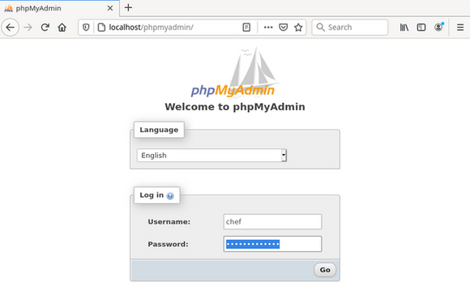
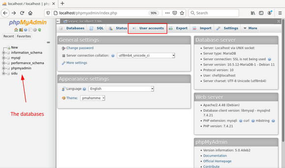
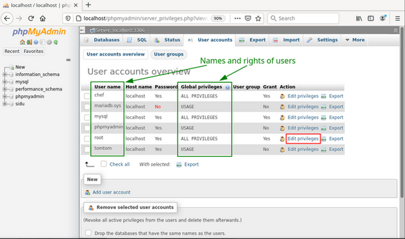
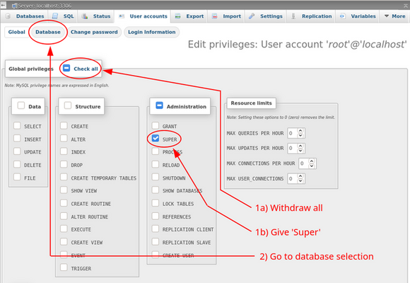
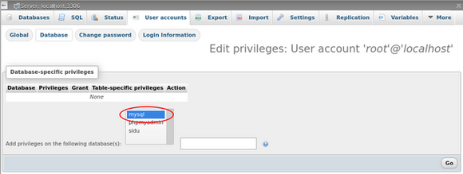
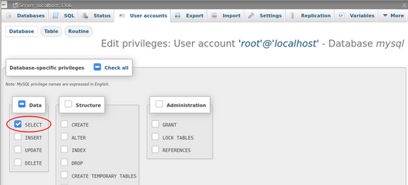
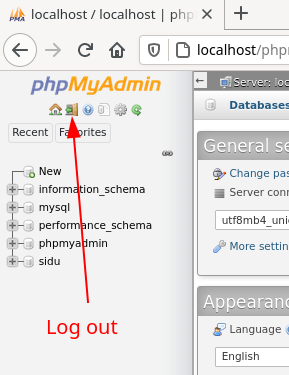

% LAMP - MariaDB 

## Set up MariaDB

### MariaDB in the file system

Debian has fully integrated the files of MariaDB into the file system according to their function:

+ the executable program *mariadb* and the link *mysql* into `/usr/bin/`
    + (The latter points to `/usr/bin/mariadb`.)
+ the installed plugin for MariaDB into `/usr/lib/mysql/plugin/`
+ shared program parts and localizations into `/usr/share/mysql/`
+ the configuration directories and files into `/etc/mysql/`
+ the databases and log files into `/var/lib/mysql/`
+ system files necessary at runtime into `/run/mysqld/`

The files inside the directories mentioned before should not be edited manually. The only exception is the configuration of MariaDB under `/etc/mysql/`, if you know exactly how to proceed. Otherwise use the [MariaDB-CLI](0522-lamp-sql_en.md#mariadb-cli) or a frontend like [phpMyAdmin](0522-lamp-sql_en.md#phpmyadmin).

### Initial configuration

After installation, as described in [LAMP test server for developers](0520-lamp-start_en.md#lamp-web-server), MariaDB is *'open like a barn door to anyone'*, because, by default, the two users **root** and **anonymous** are created (without password) as well as a test database.

Therefore we call the program **`mysql_secure_installation`** in the root terminal.  
Here we make quite a few settings to secure the database. The necessary entries are highlighted like this: `\<- - [ ]`.

~~~
# mysql_secure_installation  

In order to log into MariaDB to secure it, we'll need the
current password for the root user. If you've just
installed MariaDB, and you haven't set the root password
yet, the password will be blank, so you should just press
enter here.

Enter current password for root:        «--[Enter]  
OK, successfully used password, moving on...

Setting the root password or using the unix_socket ensures  
that nobody can log into the MariaDB root user without  
the proper authorisation.

You already have your root account protected,  
so you can safely answer 'n'.

Switch to unix_socket authentication [Y/n]:   «--[n]  
 ... skipping.

You already have your root account protected,  
so you can safely answer 'n'.

Change the root password? [Y/n]:   «--[y]  
New password:             «--[mein_mariadb_root_passwort]  
Re-enter new password:    «--[mein_mariadb_root_passwort]  
Password updated successfully!  
Reloading privilege tables..  
... Success!

By default, a MariaDB installation has an anonymous user,  
allowing anyone to log into MariaDB without having to  
have a user account created for them. This is intended  
only for testing, and to make the installation go a bit  
smoother. You should remove them before moving into a
production environment.

Remove anonymous users? [Y/n]:   «--[y]  
... Success!

Normally, root should only be allowed to connect from  
'localhost'. This ensures that someone cannot guess at  
the root password from the network.

Disallow root login remotely? [Y/n]   «--[y]  
... Success!

By default, MariaDB comes with a database named 'test'  
that anyone can access. This is also intended only for  
testing, and should be removed before moving into a  
production environment.

Remove test database and access to it? [Y/n]   «--[y]  
- Dropping test database...  
... Success!  
- Removing privileges on test database...  
... Success!

Reloading the privilege tables will ensure that all  
changes made so far will take effect immediately.

Reload privilege tables now? [Y/n]   «--[y]
... Success!

Cleaning up...

All done! If you've completed all of the above steps,  
your MariaDB installation should now be secure.

Thanks for using MariaDB!
~~~

As a result, the user **root** has received a (hopefully secure) password and can no longer log in remotely. The user **anonymous** and the database *"Test"* have been removed.

### MariaDB CLI

We reach the commandline interface in the terminal by typing **`mariadb -u \<user\> -p`**. After entering the password, we see the greeting and the new prompt `MariaDB [(none)]>`.

~~~
# mariadb -u root -p
Enter password:
Welcome to the MariaDB monitor.  [...]

MariaDB [(none)]>
~~~

For security reasons we only log in as **root** at the beginning to create the project database, a user for everyday work on it, and a user to replace root.  
Later in the [phpMyAdmin](0522-lamp-sql_en.md#phpmyadmin) section, we revoke the root user's all-encompassing privileges so that a potential attacker will be unsuccessful at this point.

**Create a database**

We are still logged into the terminal and create a new database for our project:

~~~
MariaDB [(none)]> CREATE DATABASE sidu;
Query OK, 1 row affected (0.002 sec)
~~~

That's all. If we want to delete this database, the required command is **`DROP DATABASE sidu;`**.

**Create a user**

First we create our project user with the name **tomtom** and assign him exclusively all rights to the project database *"sidu"*:

~~~
MariaDB [(none)]> CREATE USER tomtom@localhost IDENTIFIED BY '<enter a password for tomtom here>';
Query OK, 0 rows affected (0.002 sec)

MariaDB [(none)]> GRANT ALL ON sidu.* TO tomtom@localhost;
Query OK, 0 rows affected (0.001 sec)
~~~

Now repeat the same procedure for the user **chef**, who should take over the task of root.

~~~
MariaDB [(none)]> CREATE USER chef@localhost IDENTIFIED BY '<enter a password for chef here>';
Query OK, 0 rows affected (0.002 sec)

MariaDB [(none)]> GRANT ALL ON *.* TO chef@localhost WITH GRANT OPTION;
Query OK, 0 rows affected (0.001 sec)

MariaDB [(none)]> FLUSH PRIVILEGES;
~~~

The new users differ in their rights.

tomtom has all rights only for the database *"sidu"* (sidu.\*).  
chef has all rights to all databases (\*.\*) and users (WITH GRANT OPTION).

So the user **chef** can take over the function of the user **root**, and **tomtom** is the user for work on our project database.  
The logout is done by: **`\q`**.

~~~
MariaDB [(none)]> \q
Bey
#
~~~

**Queries**

We look at the result in a terminal, this time as user **chef**.  
First the users and then the existing databases:

~~~
MariaDB [(none)]> SELECT User,Host FROM mysql.user;
+-------------+-----------+
| User        | Host      |
+-------------+-----------+
| chef        | localhost |
| mariadb.sys | localhost |
| mysql       | localhost |
| phpmyadmin  | localhost |
| root        | localhost |
| tomtom      | localhost |
+-------------+-----------+
6 rows in set (0.002 sec)

MariaDB [(none)]> SHOW DATABASES;
+--------------------+
| database           |
+--------------------+
| information_schema |
| mysql              |
| performance_schema |
| phpmyadmin         |
| sidu               |
+--------------------+
5 rows in set (0.001 sec)
~~~

If we log out of MariaDB and log back in as user **tomtom**, the two queries look like this:

~~~
MariaDB [(none)]> SELECT User,Host FROM mysql.user;
ERROR 1142 (42000): SELECT command denied to user 'tomtom'@'localhost' for table 'user'.

MariaDB [(none)]> SHOW DATABASES;
+--------------------+
| Database           |
+--------------------+
| information_schema |
| sidu               |
+--------------------+
2 rows in set (0.001 sec)
~~~

It is easy to see that the user **tomtom** does not get access to system relevant data.

### phpMyAdmin

As seen before, MariaDB can be administered completely via the command line. If you know the syntax, which requires profound knowledge, you will quickly get the desired result this way.

We use the programm `phpMyAdmin`, which is more suitable for less experienced users, and enter:  
http://localhost/phpmyadmin/  
into the browser address bar. If we have already gone through the configuration according to the manual page [LAMP - Apache](0521-lamp-apache_en.md#apache-configuration), the call is:  
https://server1.org/phpmyadmin/

To remove the rights of the database admin **root**, as mentioned above, we use our new database admin **chef** with his password in the login window right away.

In the start window we see all databases in the left column. Then we select the tab *"User accounts"* in the center area.

The user accounts overview shows all users and their rights in short form. Here we select the switch *"Edit privileges"* for the **root** user.

Now we see the detailed permissions for the **root** user. Here we first remove all his rights (1a), then, in the area *"Administration"*, grant the right *"Super"* (1b), and execute the action by clicking the *"OK"* button at the very bottom right of this page (not visible in the screenshot). 

Afterwards we go to the next page via the *"Database"* button (2).

After selecting the database *"mysql"* and *"OK"*, a window opens with the detailed rights to the database *"mysql"* for the user **root**.

Only choose the method *"SELECT"*. A click on *"OK"* executes the sql command.

So we are done and leave *phpMyAdmin* via the door icon placed in the left column.

phpMyAdmin offers extensive possibilities for the administration of databases, their tables, and their contents. Note the *"Export"* tab in the main window, behind which you will find the option to backup data.

### Integration in Systemd

The control of MariaDB has been integrated into Systemd in Debian, and thus also in siduction. MariaDB starts automatically when the server is booted. The control calls are:

~~~
# systemctl [start | stop | restart] mariadb.service
~~~

Startup and error messages of the server are logged in the systemd journal.  
Detailed information is available on the external web page [MariaDB Systemd](https://mariadb.com/kb/en/systemd/).

When searching the Internet for MariaDB's control panel, make sure that the search results refer to Systemd.

### MariaDB Log

The Systemd Journal contains messages about the startup process of the `mariadb.service`. It is the first place to go to when errors occur.  
In the console, the command `journalctl` displays the messages about MariaDB with:

~~~
journalctl -n 25 -u mariadb.service
~~~

(here the last 25 lines)

Or continuously with:

~~~
journalctl -f -u mariadb.service
~~~

In addition, you can switch on the logging of sql actions in the MariDB CLI like this:

~~~
MariaDB [(none)]> SET GLOBAL general_log=1;
~~~

This creates a log file with the pattern `<host>.log` in the directory  
`/var/lib/mysql/`.  
**Caution**: This is an absolute performance killer and only meant to monitor actions in the short term.

### Sources MariaDB

[MariaDB Documentation](https://mariadb.com/kb/en/documentation/)  
[MariaDB Systemd](https://mariadb.com/kb/en/systemd/)

and the manpage

~~~
man mariadb
~~~

[phpMyAdmin documentation](https://docs.phpmyadmin.net/en/latest/)

Last edited: 2022/04/04

